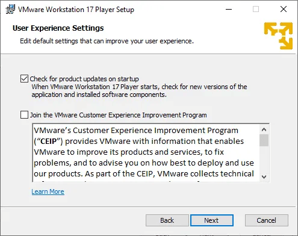
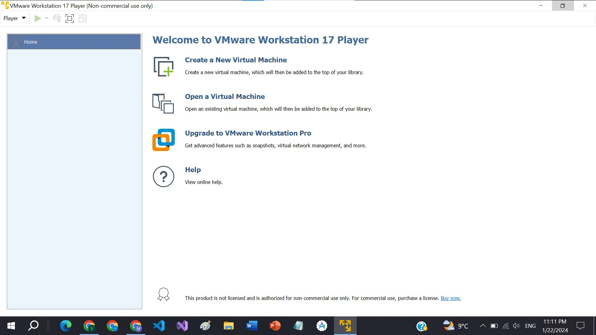
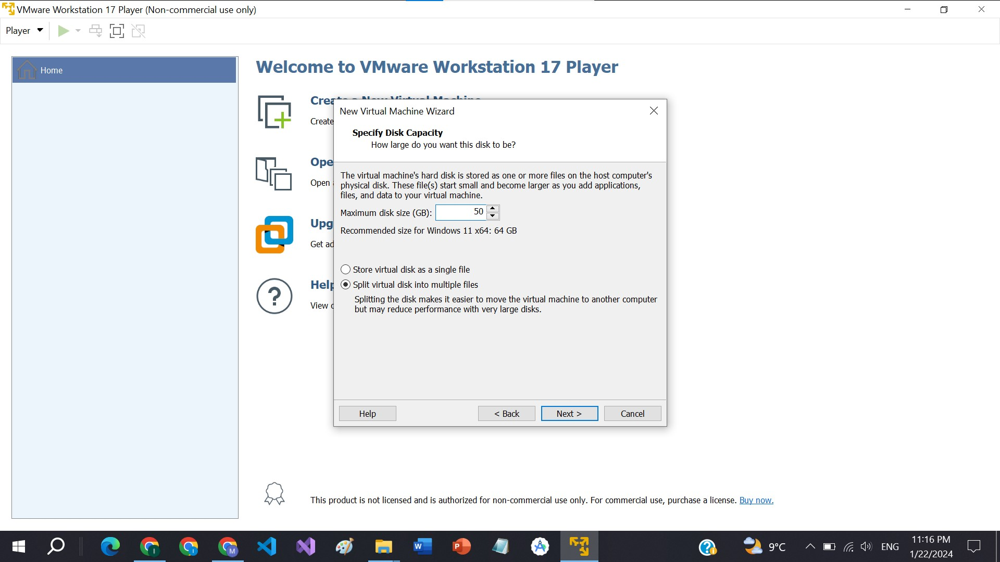
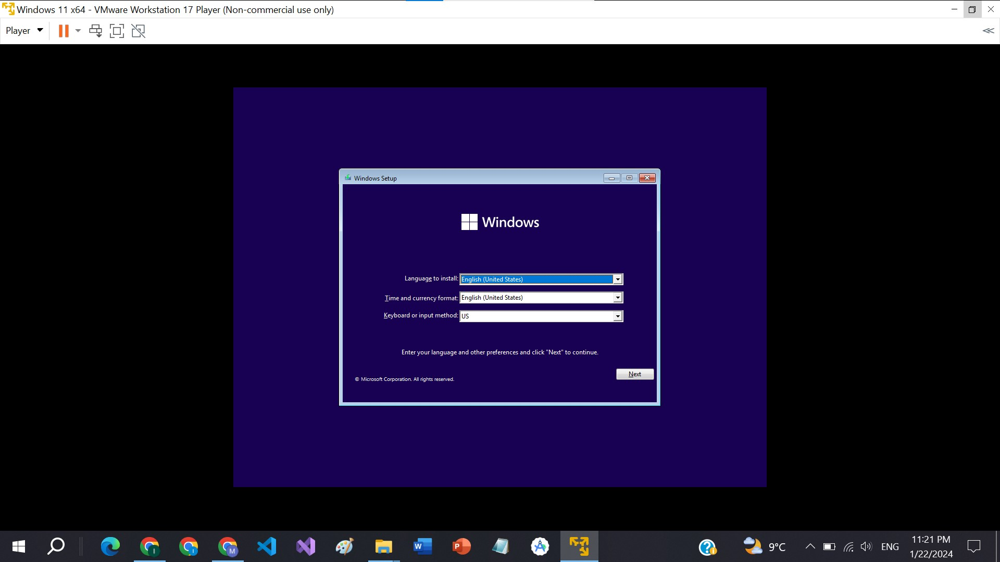
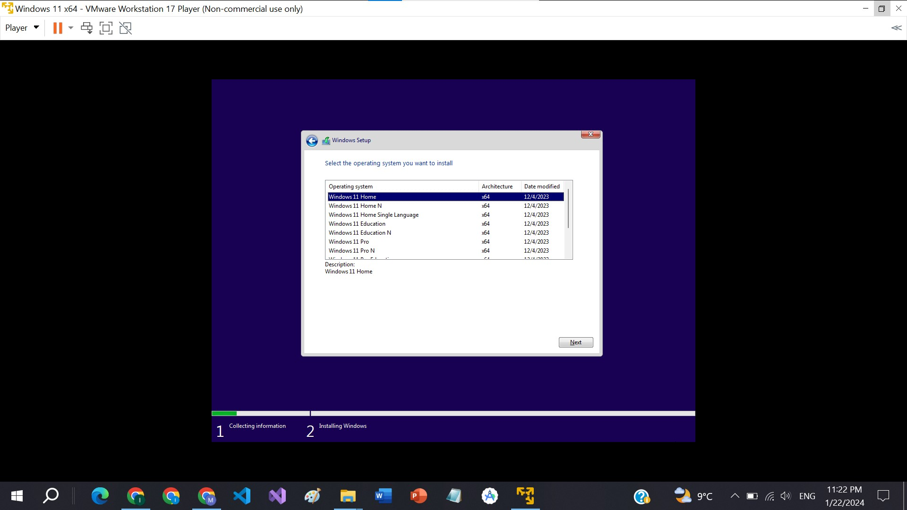

> # Window Installation in Virtual Box
>
> Author : Muhammad Jilani (2022-CS-192)

## Virtual Box : 

​				VirtualBox is a type of software that allows you to run multiple operating  systems on a single device, effectively creating a computer within a computer.  These additional systems are known as virtual machines. It’s used for various  purposes, such as software development and testing, and can be installed on any  Intel- or AMD-powered computer.

## VMware : 

​		   We will use VMware Virtual Box.  VMware Workstation Player is  recognized as a virtualization  solution that supports a variety of  operating systems on a single  machine without requiring a reboot.  It allows for seamless data sharing  between hosts and guests and is  designed for IT professionals.

## Downloading Window 11 .iso file

1. Head to the official Microsoft website. Web site link : [Microsoft](https://www.microsoft.com/software-download/windows11)
   
2. Scroll down and find the option of  **Download Windows 11 Disk Image (ISO) for x64 devices**.
   
3. Select the Windows 11 ( multi edition iso for x64 devices).
   
4. Select the language of window 11.
   
5. Hit the confirm option and your window 11 starts downloading.
   

## Downloading of VMware

1. Head to the official VMware Workstation download  page. Link of website :[VMware](https://www.vmware.com/products/workstation-pro/workstation-pro-evaluation.html)
   

   

2. Click "Download Now"  according to your Operating system.
   

3. Save the downloaded .exe file to a convenient location (e.g., Downloads folder).

## Installation of VMware

1. Hit “Next”.
   
2. Click “Next” and then hastily accept the terms and conditions without reading anything as per usual.
   
3. If you see the following screen, check the box to install WHP (this part may not show up as it is dependent on your device).
   
4. . On the next screen, you don’t need to change anything, unless you are using an international keyboard or are using a keyboard with extra keys.
   
5. For the user experience settings. Checking the second one just depends on if you care about certain data being sent during your usage of the virtualization software.
   
6. Hit “Next” again.
   
7.  And you’re ready to install.
   
8. Once it’s done, you can click “Finish”.
   

## Creating Virtual Machine Environment in VMware

1.  Open up the software, and since we’re utilizing VMWare for non-commercial use, we continue with the first option.

   

   

2. Click “Continue” one more time and then you’ll be greeted with VMWare Workstation Player’s main dashboard.
   

3. You will then be greeted with another wizard, this time to set up a new virtual machine. Browse your system’s files to find wherever you downloaded your Ubuntu iso and then select “Next.”
   

4. Next up, we’ll be setting our username and password.
   

5. . Set the disk size you want to allocate the virtual machine and click the “Next” option.

6. . Hit "Customize Hardware"and the select the Ram you want to allocate the virtual machine and click the “Close” option.
   

7.  Click "Finish"and finally, we can create the virtual machine and power it on right away.
   

## Window Installation

1. Select the language of your Window and press “Next”.
   
2.  Click at “Install” option.
   
3. Select the window version you want to use or install and press “Next”.
   
4. Check or tick the Agreement box and press “Next”.
   
5.  Now Select the option of installation.
   
6. Make the partition of the drive you allocated to your victual machine earlier.
   

#### Installation is Complete Now

Desktop Interface

> Thank you!
