#                        	     OPERATING SYSTEMS LAB # 3

​				Muhammad Jilani (2022 - CS - 192)

​							    TASK  #  1 	 

Q # 1 : 

​	Created a file named “2022_CS_192.txt”. Also writes 10 lines in it.	

​	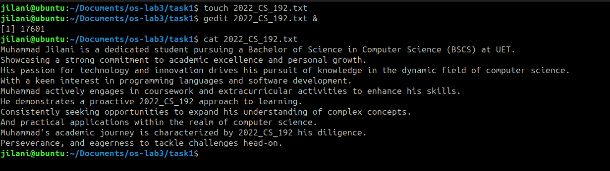

Q # 2 : 

​	Created another file names "jilani.txt" and writes 10 lines in it.	

​	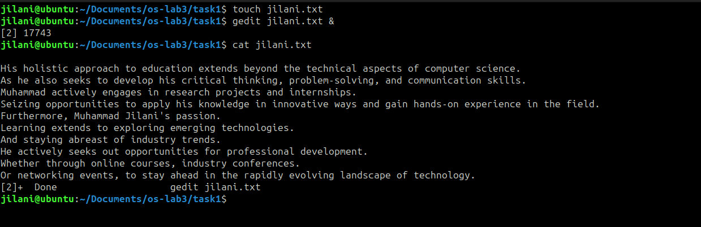

Q # 3 : 

​	Merge the data of both of files and prints on the console.	

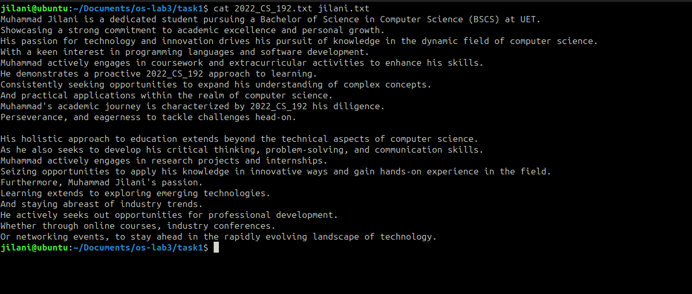

Q # 4 : 

​	Merge the data of both files and redirects it towards new file and print it on the console.	

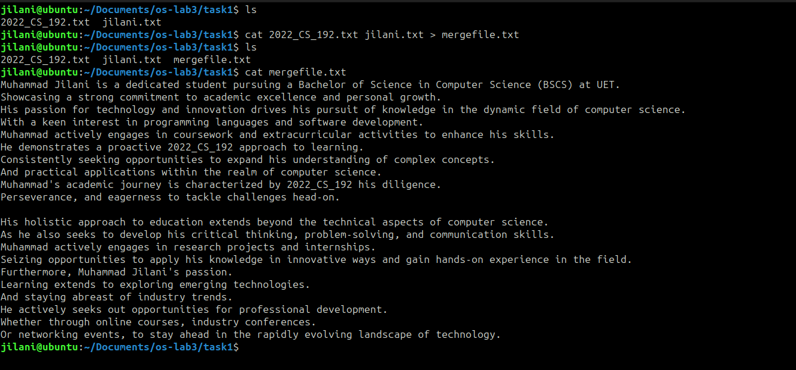

Q # 5 : 

​	Prints first 2 lines of first file on the console.	

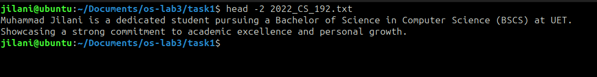

Q # 6 : 

​	Prints last 2 lines of second file on the console.

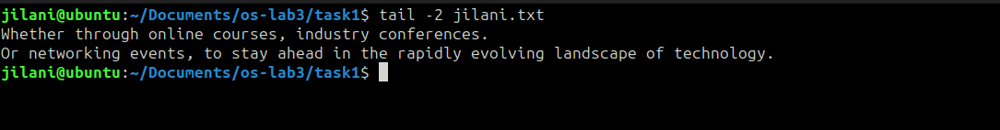

Q # 7 : 

​	Finds my roll number in first file.	

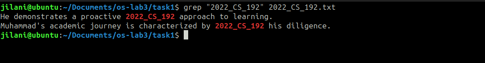

Q # 8 : 

​	Give execute permissions to group for second file.	

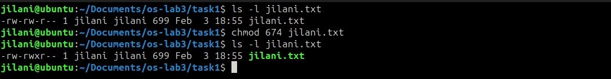

Q # 9 : 

​	Remove write permissions to owner for second file.

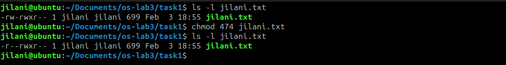

Q # 10 : 

​	Prints present working directory.

​	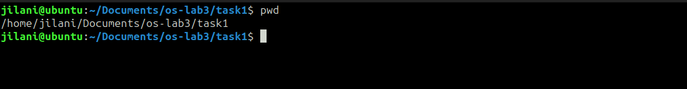

Q # 11 : 

​	Going back to desktop and lists all the files on desktop directory.

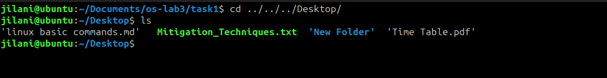

Q # 12 : 

​		Creates new folder named "2022cs192" on desktop for personal files and pictures.

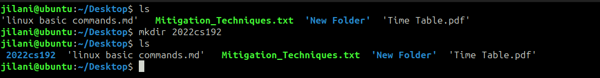

Q # 13 : 

​	Dispays the current time on the console.

​	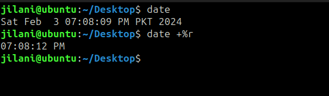

Q # 14 : 

​	Displays a "Thank You" message on the console.

​	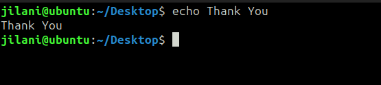

### 						   	TASK  #  2  

Q # 1 : 						

​	Creates a new file names "2022cs192_OS-lab_rules.txt" and write all lab rules in it.	

​	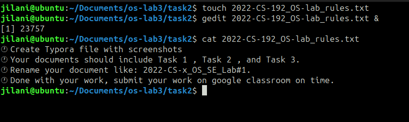

Q # 2 : 

​	We want to set the right of created file as [- rwx r-x r--].

First convert these permission to binary format which will be as follows:

- For owner rwx = 111
- For group r-x = 101
- For others r-- = 100

Now convert this binary representations to octal format which will be as follows : 

- 111 is equals to 7 in octal.
- 101 is equals to 5 in octal.
- 100 is equal to 4 in octal.

 So, numeric format of given rights is equals to 754.

Q # 3 : 

​	Now to change the persmissions using chmod command with derived number which is 754.

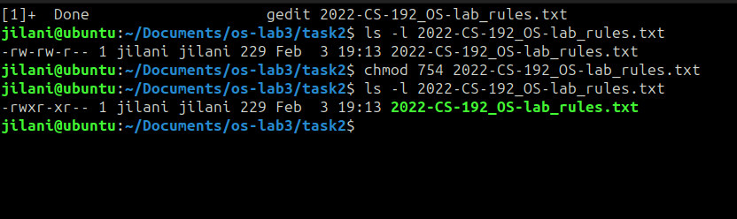

Q # 4 : 

​	Append output of "ls" command to text file using redirection operator.

​	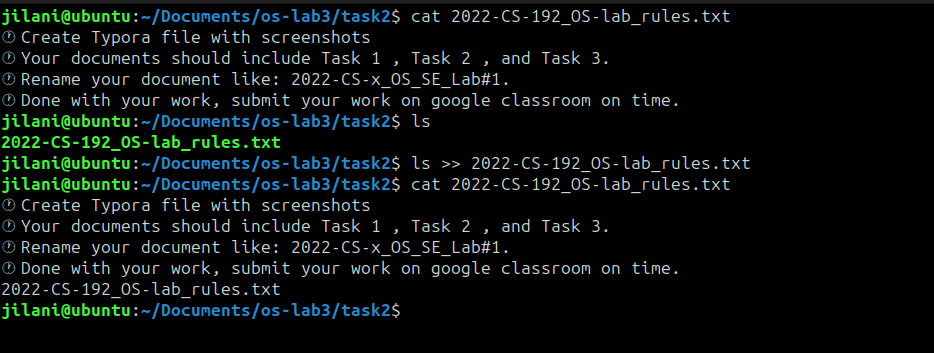

​	

​	