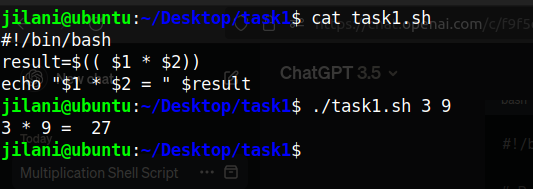
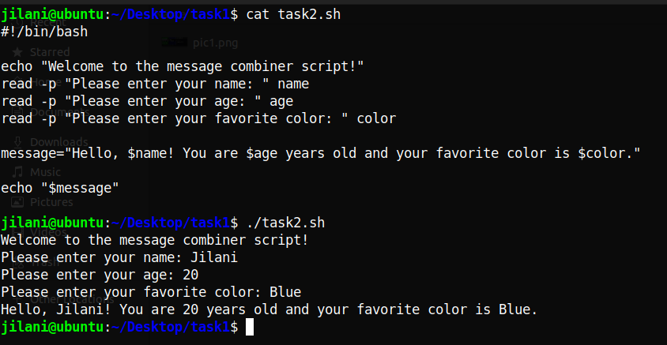
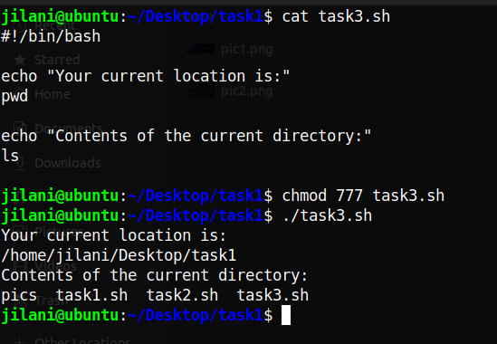
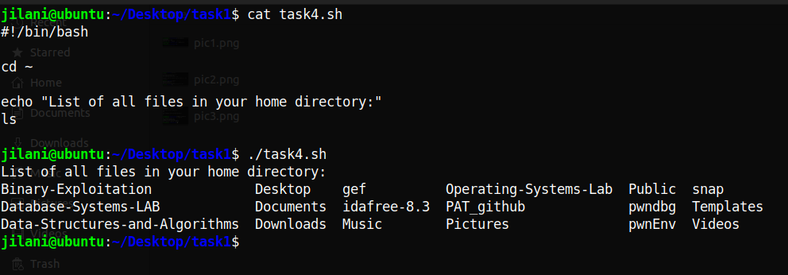
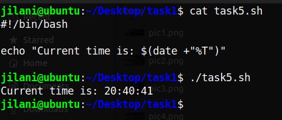
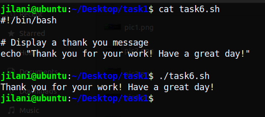
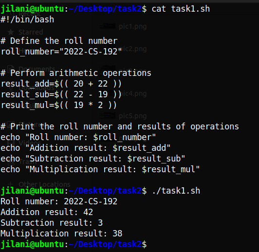
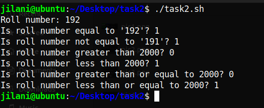

> # Operating Systems Lab - 4
>
> Author : Muhammad Jilani 2022-CS-192

## Task - 1 :  Mr. Tom's Ubuntu Adventure

1. **Create a script to multiply command line arguments:** Created a simple script, named `task1.sh`. Used `$(($1 * $2))` to multiply the arguments and echoed the result.

**2.Create a script to combine user input:** Created a script, named `task2.sh`, using `read` to gather user information. Combined the input into a message and echoed it.

**3.Help Mr. Tom find his location:** Created a script, named `task3.sh`, using `pwd` to display Mr. Tom's current location.

**4.List files in the home directory:** Created a script, named `task4.sh`, using `cd ~` command to change directory to home and then use `ls` command to list all files in my home directory.

**5.Display the current time:** Created a script, named `task5.sh`, using `date` to display the current system time.

**6.Display a thank you message :** Created a script, named `task6.sh`, using `echo` to display a thank you message on console.

## Task - 2 :  Shell Script Mastery

1. **Script with arithmetic operators:** Created a script, named `arithmetic_operations.sh`, using double parentheses `(( ))` to perform arithmetic operations and displayed results with a roll number.

   

​       

**2.**Script with relational operators: Created a script, named `relational_operations.sh`, using double parentheses `(( ))` to perform relational operations and displayed results with a roll number.

